# TP 2 - Vendredi 23 Janvier 2026

## Fais sur Windows

## I] Exploration locale en solo

### 1. Affichage d'informations sur la pile TCP/IP locale

- En CLI
    - Taper :
        ```bat 
        ipconfig /all
        ```
    - Wifi :
        | Élément | Valeur |
        |--------|--------|
        | Nom | Carte réseau sans fil Wi-Fi 2
        | Adresse MAC | XX:XX:XX:XX:XX:XX
        | Adresse IP | 10.33.65.62/20
        | Adresse réseau | 10.33.64.0
        | Adresse de broadcast | 10.33.79.255

    - Afficher la passerelle :
        ```bat 
        ipconfig
        ``` 
        <br>
        - Trouver la ligne "Passerelle par défaut"
        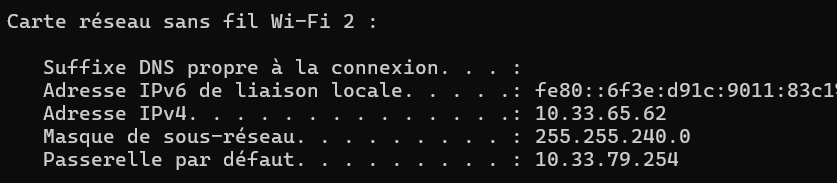<br>
        - Ici : 10.33.79.254


- En GUI

    - Aller dans paramètres > Réseaux et internet > Wifi > "Nom du wifi" <br>
    Exemple : 
    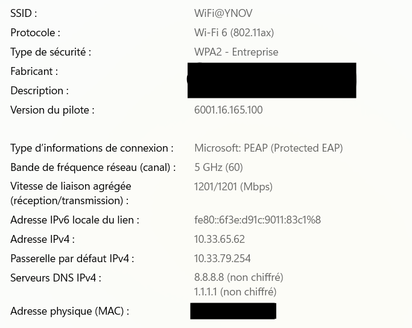

- Questions :

    - La passerelle permet au réseau privé de communiquer avec le réseau publique. Dans le cas de l'école, ça permet aux élèves d'accéder à internet.


### Modifications des informations

##### A. Modification d'adresse IP - pt. 1

- La première adresse disponible est 10.33.64.1 et la dernière est 10.33.79.254. Cette dernière apparatient à la passerelle, donc, pour un client, c'est 10.33.79.253

- On regarde les adresse IP : 
    ```bat 
    arp -a
    ```

- Changement de l'adresse IP : <br> 
    Aller dans les paramètres > Réseaux et internet > Paramètres réseaux avancés > "Cliquer sur la flèche du réseau correspondant" > Afficher les propriétés supplémentaires > Modifier > Manuel <br>
    On change : <br>
    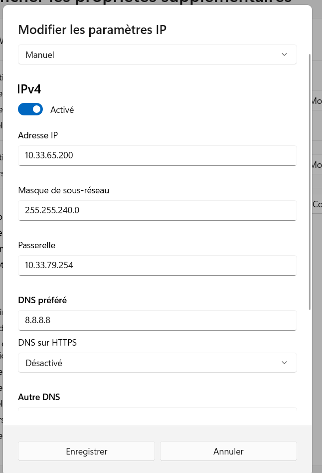 <br><br>
    Si on retourne sur le terminal et qu'on tape :
    ```bat 
    ipconfig
    ``` 
    <br>

    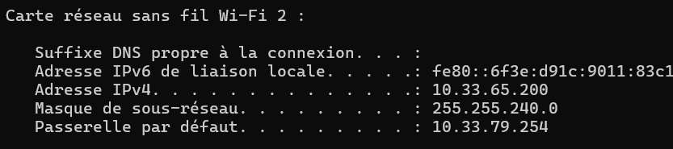

- Pour scanner le réseau : 
    ```bat 
    arp -a
    ```

#### B. nmap

- Installation de Nmap depuis : [nmap.org](https://nmap.org/download#windows)

#### C. Modification d'adresse IP - pt. 2

- Voir les adresses IP utilisées sur le réseau Wifi@YNOV :
    ```bat 
    arp -a
    ``` 
    <br>

    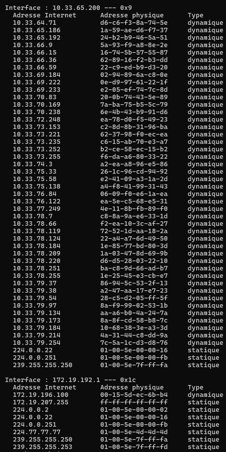

- On regarde les interfaces de la machine
    ```bat 
    netsh interface ipv4 show interfaces
    ```

- Changement de l'IP avec Nmap : 
    ```bat 
    netsh interface ipv4 set address name=9 source=static address=10.33.71.50 mask=255.255.240.0 gateway=10.33.64.254
    ```

<br>

Résultat : 

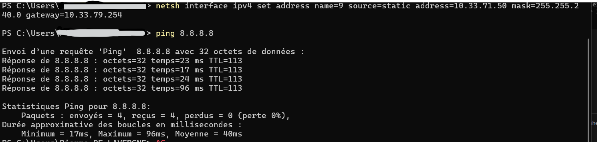

J'ai donc bien internet avec cette adresse IP.


## III. Manipulations d'autres outils/protocoles côté client

### 1. DHCP

- Afficher l'adresse IP du serveur DHCP :
    ```bat 
    ipconfig /all
    ```

    Résultat :
    
    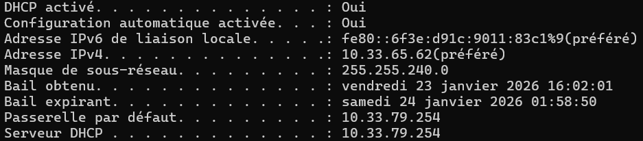
    Donc l'adresse IP du serveur DHCP est 10.33.79.254/20

- L'adresse expire le samedi 24 janvier 2026 à 01:58:50

- Le serveur DHCP de l'école fournit une adresse IP en fonction de l'adresse MAC. Donc il n'est pas possible de changer l'adresse IP normalement. Cependant, voici les commandes si c'était possible :
    - Jeter son adresse IP actuelle :
        ```bat 
        ipconfig /release
        ```
    - Redemander une adresse :
        ```bat 
        ipconfig /renew
        ```

### 2. DNS

- Chercher le serveur DNS enregistré sur l'ordi :
    ```bat 
    ipconfig /all
    ```

    Résultat :

    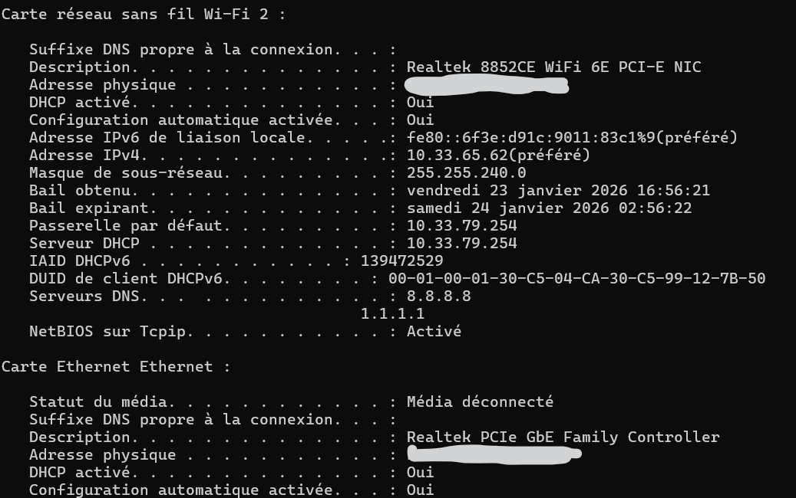

    Serveur DNS :

    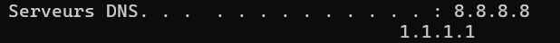


- nslookup

    - Avec google.com
        ```bat 
        nslookup google.com
        ```

        Résultat :

        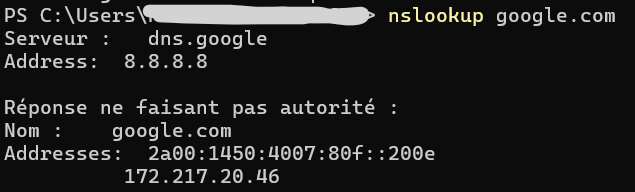 <br>
        Le serveur qui a été contacté a l'adresse 172.217.20.46.

    - Avec ynov.com
        ```bat 
        nslookup ynov.com
        ```

        Résultat :

        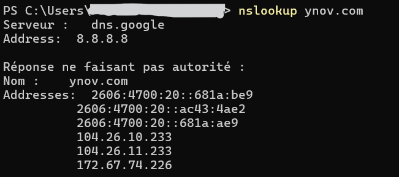 <br>
        Il y a trois adresses IP qui sont connectés au nom de domaine "ynov.com"

- reverse lookup

    - Avec 78.78.21.21
        ```bat 
        nslookup 78.78.21.21
        ```

        Résultat :

        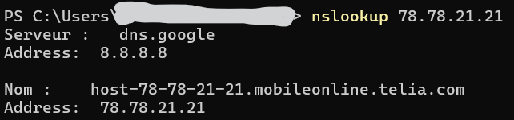 <br>
        L'adresse 78.78.21.21 appartient à http://mobileonline.telia.com/

    - Avec 92.16.54.88
        ```bat 
        nslookup 92.16.54.88
        ```

        Résultat :

        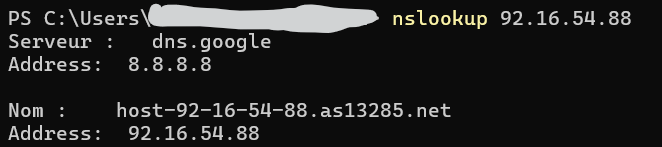 <br>
        L'adresse 92.16.54.88 appartient à http://as13285.net

    