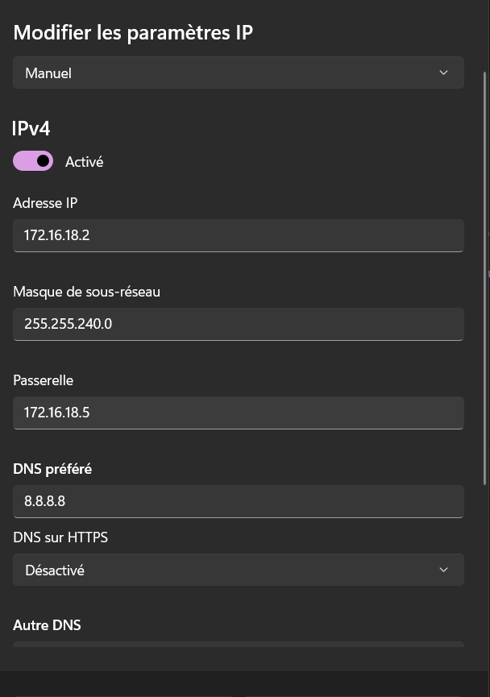
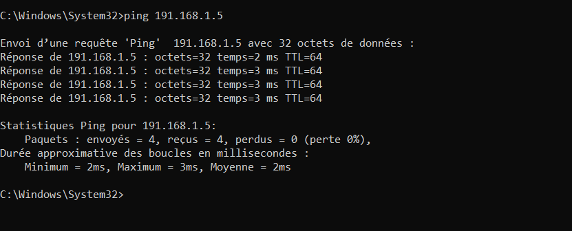
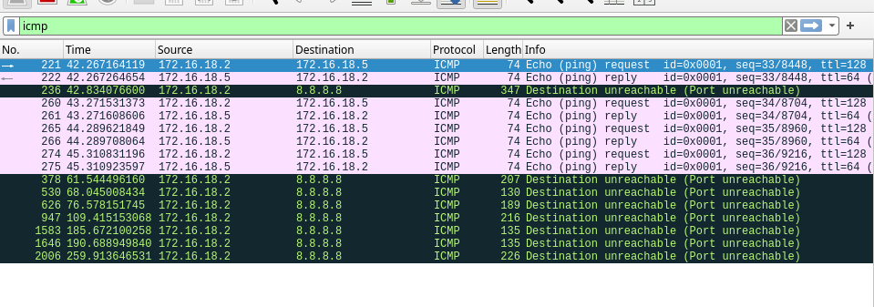
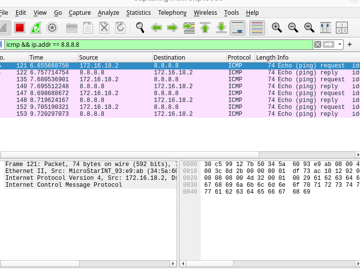
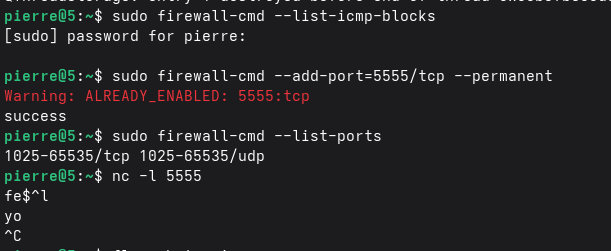

# TP 2 - Vendredi 23 Janvier 2026

## Fais sur Windows

## I] Exploration locale en solo

### 1. Affichage d'informations sur la pile TCP/IP locale

- En CLI
    - Taper :
        ```bat 
        ipconfig /all
        ```
    - Wifi :
        | Élément | Valeur |
        |--------|--------|
        | Nom | Carte réseau sans fil Wi-Fi 2
        | Adresse MAC | XX:XX:XX:XX:XX:XX
        | Adresse IP | 10.33.65.62/20
        | Adresse réseau | 10.33.64.0
        | Adresse de broadcast | 10.33.79.255

    - Afficher la passerelle :
        ```bat 
        ipconfig
        ``` 
        <br>
        - Trouver la ligne "Passerelle par défaut"
        
         <br>
        - Ici : 10.33.79.254


- En GUI

    - Aller dans paramètres > Réseaux et internet > Wifi > "Nom du wifi" <br>
    Exemple : 
    

- Questions :

    - La passerelle permet au réseau privé de communiquer avec le réseau publique. Dans le cas de l'école, ça permet aux élèves d'accéder à internet.


### Modifications des informations

##### A. Modification d'adresse IP - pt. 1

- La première adresse disponible est 10.33.64.1 et la dernière est 10.33.79.254. Cette dernière apparatient à la passerelle, donc, pour un client, c'est 10.33.79.253

- On regarde les adresse IP : 
    ```bat 
    arp -a
    ```

- Changement de l'adresse IP : <br> 
    Aller dans les paramètres > Réseaux et internet > Paramètres réseaux avancés > "Cliquer sur la flèche du réseau correspondant" > Afficher les propriétés supplémentaires > Modifier > Manuel <br>
    On change : <br>
     <br><br>
    Si on retourne sur le terminal et qu'on tape :
    ```bat 
    ipconfig
    ``` 
    <br>

    

- Pour scanner le réseau : 
    ```bat 
    arp -a
    ```

#### B. nmap

- Installation de Nmap depuis : [nmap.org](https://nmap.org/download#windows)

#### C. Modification d'adresse IP - pt. 2

- Voir les adresses IP utilisées sur le réseau Wifi@YNOV :
    ```bat 
    arp -a
    ``` 
    <br>

    

- On regarde les interfaces de la machine
    ```bat 
    netsh interface ipv4 show interfaces
    ```

- Changement de l'IP avec Nmap : 
    ```bat 
    netsh interface ipv4 set address name=9 source=static address=10.33.71.50 mask=255.255.240.0 gateway=10.33.64.254
    ```

<br>

Résultat : 


J'ai donc bien internet avec cette adresse IP.


## II. Exploration locale en duo

### 1. Prérequis

### 2. Câblage

### 3. Création du réseau

J'ai changé l'adresse IP directement avec le GUI dans les paramètres.

Avec un /24 :

``` bash
pierre@5:~$ ip a
1: lo: <LOOPBACK,UP,LOWER_UP> mtu 65536 qdisc noqueue state UNKNOWN group default qlen 1000
    link/loopback 00:00:00:00:00:00 brd 00:00:00:00:00:00
    inet 127.0.0.1/8 scope host lo
       valid_lft forever preferred_lft forever
    inet6 ::1/128 scope host noprefixroute 
       valid_lft forever preferred_lft forever
2: enp109s0: <BROADCAST,MULTICAST,UP,LOWER_UP> mtu 1500 qdisc fq_codel state UP group default qlen 1000
    link/ether 30:c5:99:12:7b:50 brd ff:ff:ff:ff:ff:ff
    altname enx30c599127b50
    inet 191.168.1.5/24 brd 191.168.1.255 scope global noprefixroute enp109s0
       valid_lft forever preferred_lft forever
    inet6 fe80::8e14:318d:b3fe:4838/64 scope link noprefixroute 
       valid_lft forever preferred_lft forever
3: wlp108s0: <BROADCAST,MULTICAST,UP,LOWER_UP> mtu 1500 qdisc noqueue state UP group default qlen 1000
    link/ether 5e:5e:0d:23:15:93 brd ff:ff:ff:ff:ff:ff permaddr 50:2e:91:e0:1c:ec
    altname wlx502e91e01cec
    inet 10.33.74.31/20 brd 10.33.79.255 scope global dynamic noprefixroute wlp108s0
       valid_lft 30819sec preferred_lft 30819sec
    inet6 fe80::595b:c06b:43b1:30b2/64 scope link noprefixroute 
       valid_lft forever preferred_lft forever
```

``` bash
pierre@5:~$ ping 191.168.1.2
PING 191.168.1.2 (191.168.1.2) 56(84) bytes of data.
64 bytes from 191.168.1.2: icmp_seq=1 ttl=128 time=3.38 ms
64 bytes from 191.168.1.2: icmp_seq=2 ttl=128 time=3.40 ms
64 bytes from 191.168.1.2: icmp_seq=3 ttl=128 time=3.12 ms
64 bytes from 191.168.1.2: icmp_seq=4 ttl=128 time=2.99 ms
64 bytes from 191.168.1.2: icmp_seq=5 ttl=128 time=2.71 ms
^C
--- 191.168.1.2 ping statistics ---
5 packets transmitted, 5 received, 0% packet loss, time 4005ms
rtt min/avg/max/mdev = 2.711/3.120/3.400/0.256 ms
``` 

Et avec un /20 :

``` bash
pierre@5:~$ ip a
1: lo: <LOOPBACK,UP,LOWER_UP> mtu 65536 qdisc noqueue state UNKNOWN group default qlen 1000
    link/loopback 00:00:00:00:00:00 brd 00:00:00:00:00:00
    inet 127.0.0.1/8 scope host lo
       valid_lft forever preferred_lft forever
    inet6 ::1/128 scope host noprefixroute 
       valid_lft forever preferred_lft forever
2: enp109s0: <BROADCAST,MULTICAST,UP,LOWER_UP> mtu 1500 qdisc fq_codel state UP group default qlen 1000
    link/ether 30:c5:99:12:7b:50 brd ff:ff:ff:ff:ff:ff
    altname enx30c599127b50
    inet 172.16.18.5/20 brd 172.16.31.255 scope global noprefixroute enp109s0
       valid_lft forever preferred_lft forever
    inet6 fe80::8e14:318d:b3fe:4838/64 scope link noprefixroute 
       valid_lft forever preferred_lft forever
3: wlp108s0: <BROADCAST,MULTICAST,UP,LOWER_UP> mtu 1500 qdisc noqueue state UP group default qlen 1000
    link/ether 5e:5e:0d:23:15:93 brd ff:ff:ff:ff:ff:ff permaddr 50:2e:91:e0:1c:ec
    altname wlx502e91e01cec
    inet 10.33.74.31/20 brd 10.33.79.255 scope global dynamic noprefixroute wlp108s0
       valid_lft 30354sec preferred_lft 30354sec
    inet6 fe80::595b:c06b:43b1:30b2/64 scope link noprefixroute 
       valid_lft forever preferred_lft forever
```

``` bash
pierre@5:~$ ping 172.16.18.2
PING 172.16.18.2 (172.16.18.2) 56(84) bytes of data.
64 bytes from 172.16.18.2: icmp_seq=1 ttl=128 time=3.23 ms
64 bytes from 172.16.18.2: icmp_seq=2 ttl=128 time=4.74 ms
64 bytes from 172.16.18.2: icmp_seq=3 ttl=128 time=4.98 ms
64 bytes from 172.16.18.2: icmp_seq=4 ttl=128 time=3.61 ms
^C
--- 172.16.18.2 ping statistics ---
4 packets transmitted, 4 received, 0% packet loss, time 3003ms
rtt min/avg/max/mdev = 3.232/4.141/4.983/0.736 ms
```




### 4. Utilisation d'un des deux comme gateway

Sur mon PC (routeur), on active le routage

```bash
pierre@5:~$ sudo sysctl -w net.ipv4.ip_forward=1
net.ipv4.ip_forward = 1
pierre@5:~$ sudo firewall-cmd  --add-masquerade --permanent 
FirewallD is not running
pierre@5:~$ sudo systemctl start firewalld
pierre@5:~$ sudo firewall-cmd  --add-masquerade --permanent 
success
pierre@5:~$ sudo firewall-cmd  --reload 
success
```

### 5. Petit chat privé ?

``` bash
# Installation de netcat
sudo dnf install netcat

# On lance le chat
pierre@5:~$ nc 172.16.18.2 8888
hey
bonjour
comment allez vous
bien et toi
bien merci

```

### 6. Wireshark

``` bash
# On installe Wireshark
pierre@5:~$ sudo dnf install wireshark

pierre@5:~$ sudo wireshark 
pierre@5:~$ sudo useradd wiresharkuser
pierre@5:~$ ^[[200~sudo setcap cap_net_raw,cap_net_admin=eip /usr/bin/dumpcap
bash: sudo: command not found...
pierre@5:~$ sudo setcap cap_net_raw,cap_net_admin=eip /usr/bin/dumpcap
pierre@5:~$ getcap /usr/bin/dumpcap
/usr/bin/dumpcap cap_net_admin,cap_net_raw=eip
pierre@5:~$ sudo usermod -aG wireshark $USER
pierre@5:~$ sudo wireshark 
```




### 7. Firewall



## III. Manipulations d'autres outils/protocoles côté client

### 1. DHCP

- Afficher l'adresse IP du serveur DHCP :
    ```bat 
    ipconfig /all
    ```

    Résultat :
    
    
    Donc l'adresse IP du serveur DHCP est 10.33.79.254/20

- L'adresse expire le samedi 24 janvier 2026 à 01:58:50

- Le serveur DHCP de l'école fournit une adresse IP en fonction de l'adresse MAC. Donc il n'est pas possible de changer l'adresse IP normalement. Cependant, voici les commandes si c'était possible :
    - Jeter son adresse IP actuelle :
        ```bat 
        ipconfig /release
        ```
    - Redemander une adresse :
        ```bat 
        ipconfig /renew
        ```

### 2. DNS

- Chercher le serveur DNS enregistré sur l'ordi :
    ```bat 
    ipconfig /all
    ```

    Résultat :

    

    Serveur DNS :

    


- nslookup

    - Avec google.com
        ```bat 
        nslookup google.com
        ```

        Résultat :

         <br>
        Le serveur qui a été contacté a l'adresse 172.217.20.46.

    - Avec ynov.com
        ```bat 
        nslookup ynov.com
        ```

        Résultat :

         <br>
        Il y a trois adresses IP qui sont connectés au nom de domaine "ynov.com"

- reverse lookup

    - Avec 78.78.21.21
        ```bat 
        nslookup 78.78.21.21
        ```

        Résultat :

         <br>
        L'adresse 78.78.21.21 appartient à http://mobileonline.telia.com/

    - Avec 92.16.54.88
        ```bat 
        nslookup 92.16.54.88
        ```

        Résultat :

         <br>
        L'adresse 92.16.54.88 appartient à http://as13285.net

    